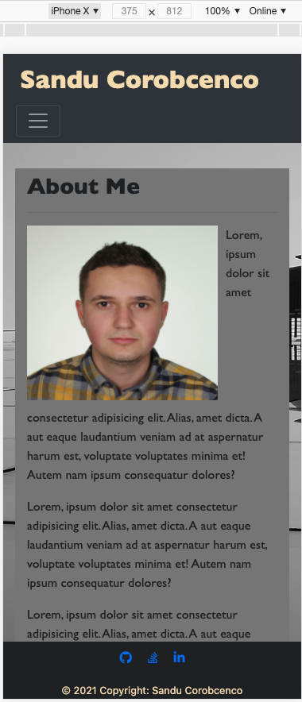
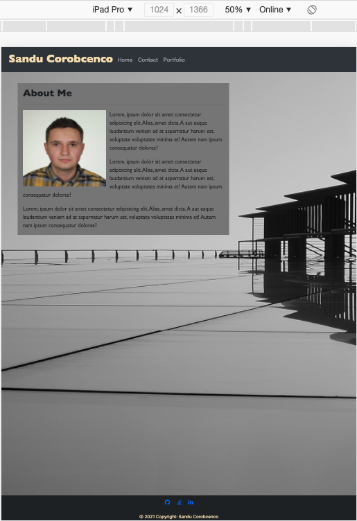
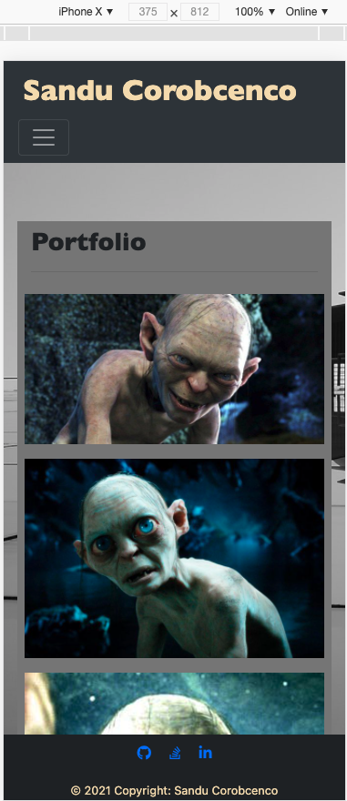
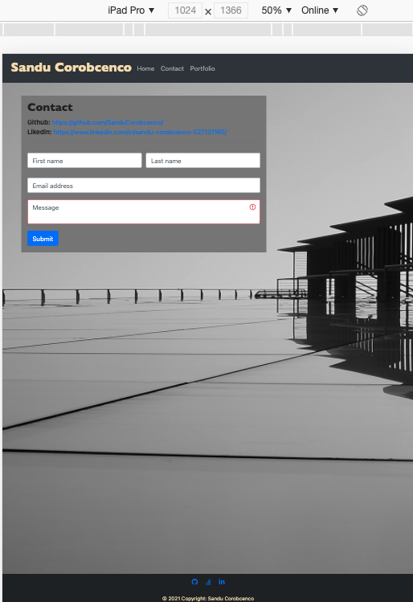

# Responsive Portfolio with Bootstrap

___

# The portfolio site is developed with the following items: 
* A navbar
* A responsive layout
* Responsive images 
* Sticky footer
___
## About Me:

* _Responsive form_
* _Responsive navbar_
* _Responsive images_
---
### Tools used:
* Navbar component
* Responsive navigation header
* Collapsable navbar
* Hidden navbar at lower screen sizes
* Layout
* Containers
* Breakpoins
* Grid system
* Rows
* Columns

 

##### Credits:
>* [Google](https://www.google.com/)
>* [Bootstrap](https://getbootstrap.com/)
>* [MDB](https://mdbootstrap.com/)
>* [Giphy](https://giphy.com/)
>* [W3Schools](https://www.w3schools.com/)
##### Contributors:

* corobcenco.sandu@gmail.com
* [Sandu Corobcenco](https://github.com/SanduCorobcenco/)
##### Directory:
* [Current Repository]()
* [Website]()
---
#### Licences: **_none_**
